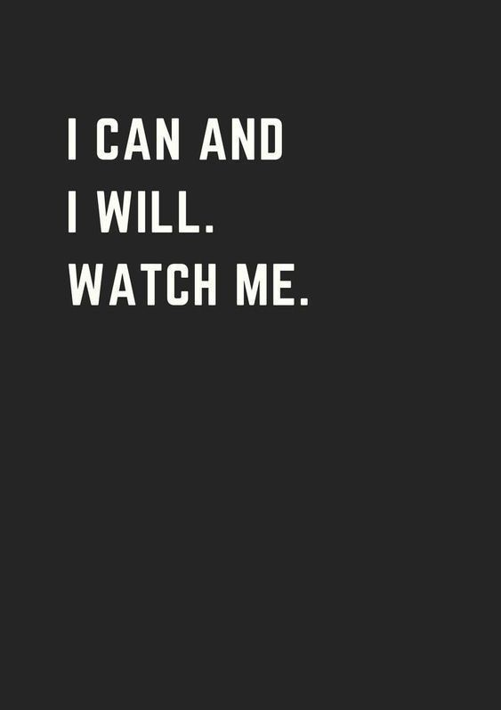

# Long Tuesday

<iframe id="long-tuesday" style="filter: grayscale(100%);" width="100%" height="500px" src="https://www.youtube.com/embed/Q87VnO-VvW8" frameborder="0" allow="accelerometer; autoplay; clipboard-write; encrypted-media; gyroscope; picture-in-picture" allowfullscreen></iframe>

I feel overwhelmed. It is difficult getting up each day. Knowing I am failing and I am making mistakes, sometimes I feel like I am moving backwards. Endlessly lost and confused. Do I want to get up tomorrow and face the same fate? 

But I push through, however difficult it may seem. Each day, it is a constant battle, an uphill climb, I have recently attempted to seek help from others around me. A challenge I need to face in life, asking for help, asking for forgiveness. 

Although it feels like the help I have sought is adding to my challenge, and instead of making things easier, making things more difficult. 

> What am I doing?

> What am I doing wrong?

> What am I doing right?

What am I doing right? Why do I focus on the wrong, before focusing on the right. Do I even recognise the right when I am faced with the wrong.

I try to correct my outlook. Stop focusing on all the wrongs. Will it pay off? Is it worth fighting for.

Of course, it is, it is my purpose. It is my challenge to overcome, but why does it just feel like a slippery slide downwards.

I will keep pushing, I will keep learning because I will be all the better for it.

Besides the challenges of my business, I have found comfort in someone else. 

She has been a new light in the dark, I have enjoyed the conversations and getting to learn more about her, as well as sharing my struggles.

Find happiness in the small things? Appreciate the effort in the small details, keep working on myself. And encourage the others that stick with me through it all. I will grow. I will succeed and we will prosper.

There are going to be difficult days, but it wouldn't be worth it if it wasn't difficult.

I love my life. And I love the people I get to call family and friends.

A long Tuesday, 16 - Feb - 2021

Lue

