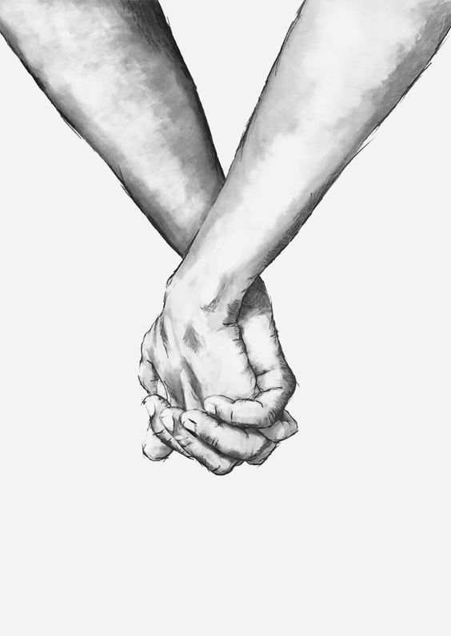
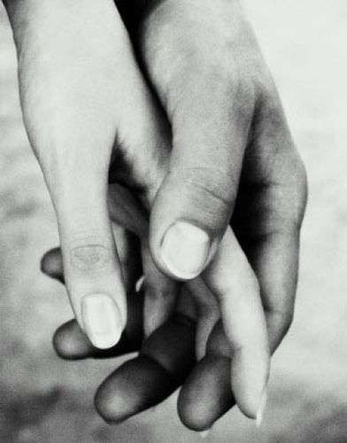
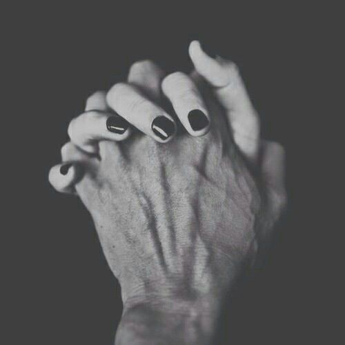

&nbsp;
# Sometimes it's just not meant to be.

&nbsp;

<iframe id="long-tuesday" style="filter: grayscale(100%);" width="100%" height="500px" src="https://www.youtube.com/embed/MbCeyb9okac" frameborder="0" allow="accelerometer; autoplay; clipboard-write; encrypted-media; gyroscope; picture-in-picture" allowfullscreen></iframe>

&nbsp;

### When you are ready, maybe we can talk?

I had an amazing "Up" this last weekend. It felt so right, I wanted to write about it yesterday but I got caught up during the day. My thoughts are all over the place, and I feel overwhelmed. 

But I think I should do my best to share this, and get it off my chest and out of my mind. So I can come back and read it again when I want to remember.

Like a whirlwind, she entered into my reality :). So refreshing to meet someone new, I really enjoyed our conversations. It was fun talking to someone new, with so much positive energy. She is mysterious, I haven't learnt too much about her, but I want to get to know her more. 

Our conversation has been brief but she has made an effort to reach out to me, even though I have been so busy. I really enjoy the attention and I hope I can reciprocate. So much chemistry, we hit it off and it was youthful fun, with a little flirting.

Who is she? How lucky I am to have met her.

Unexpected plans turned into fond memories. I hope as I get old, that I never forget the brief time we spent together. Innocent and Naive fun. I was excited when I told my friends about her, I didn't want to say too much as I didn't know what to expect. But so far it has been great 😊.

Maybe one day I will write more about our brief encounters but for now, I just wanted to share that I have met someone and she has been wonderful.

I think she is so special and I hope she knows it. I feel I must remind her. And I hope I can send this to her to remind her that no matter what happens in life, this fact will never change. We will go through difficult times, our "Ups" and our "Downs" but she will always be special in her own unique way.

After our first encounter, I felt whole again, on top of the world. It felt so good to feel something again. It is the reason for pushing through, pushing through all the difficult times that come our way. It's a reason to wake up in the morning and face the world ready for anything that comes our way.

We all have it in ourselves even when it seems so daunting, and insurmountable. We are all capable, especially if we believe we are. Again, sometimes we just need to be reminded. I hope this serves as a reminder one day for someone who needs it.

You are capable of anything you put your heart, mind and soul to. You will overcome it and all the hard work and pain will be worth it.

Celebrate YOU. You are amazing, don't forget. No matter the decisions we make, there are positives we can take away. Even when you feel you have let yourself down, or the others around you down. You can learn something and make a different decision in the future.

I am getting a little sidetracked but I guess I just wanted to share that.

Our first encounter was great, the second was even better. I could barely hide my excitement, it was all planned and I couldn't wait. From my perspective at least it was perfect. 

I couldn't ask for more from life, another experience to hold on to. In this moment of writing, I miss the feeling I experienced over the weekend. Can I have it back and live it forever? I know it's naive to expect so, I just crave it so bad. I just want to get this out there. 

Was it love? Chemistry? Lust? Confusion? I'm not sure, but whatever it was, it felt perfect. On top of the world, ready to take on the challenges ahead of me, with a spring in my step.

Finally, something was going my way! I remember why I push through, it is all worth it. However brief, I won't forget, the feeling that gives me butterflies in my stomach when I look into your eyes.

She held my hand, and I held hers. The touch of her skin between my fingers, inseparable. Whole. Together we can conquer the world. If you just stay long enough.

I hope you will remember me as I remember you. 

Forget everything else, when we are together in our world nothing else matters. What a memory, I was nervous but calm at the same time. Everything just clicked and it felt like it could last forever. Can we share this memory?

Your body is perfect. Your smile is unforgettable and your eyes are filled with magic butterflies that fill my stomach. What a rush, our bodies wrapped together, she belongs with me.

A morning to remember, waking up with her felt like she had been with me all along. Everything was just right. I will remember her smell, it made me smile, know she was there with me.

Short-lived it was, I wish there would be more, but it seems it was not meant to be. We went out separate ways. She asked to see me again later that evening and of course, I agreed. If I could even have 5 minutes again of that feeling it would be enough. Like an addiction. 

I was waiting patiently, excited to see her again and to hopefully hold each other again. I hope she had an amazing day as I had.

The evening went by, and I didn't hear much. It is ok, I'm sure she had a good day and enjoying her evening.

I hope she didn't get lost along the way? Hopefully, nothing bad has happened. Even if she went home, that is all good with me, I hope she enjoys her rest.

Let me give her, her space. No expectations and No pressure 😊.

Without expectations, we can never be disappointed. No responsibility, no accountability it's easier that way. Or so they say.

## It doesn't need to be so difficult

Life can be really difficult sometimes. Is this another challenge for me to overcome? I hope it makes me a better person tomorrow. I am working on it all the time, and I am sure I will grow into a strong man who can overcome the obstacles life throws at me. So I can be the one for everyone to depend on, I will be there for you as I know you will be there for me when I need help. On those nights that are long, lonely and dark.

It is full of twists and turns. Ups and downs. But when you look up to the stars, as I will one day, look out for the shooting star. It will be me waving to you from a distance and reminding you to never forget.

I slept alone. Uneasy and uncomfortable. I felt like I was just being paranoid but something didn't feel right. My friends always tell me to look out for the warning signs. Be careful, keep your eyes and ears open. Live your life with fear and you will never be surprised. But will you ever truly be happy and content?

Have I got it all wrong? I think I have. I refuse to change.

I will put myself out there, the real me in all its glory. Whatever you feel, it is real. Whatever I say, it is real. And I live without regret.

Today was difficult. It started hopeful, but I think today was another test, a challenge. I have kept my mind open. There is always a reason, behind most things. The answers will come in time.

It was a beautiful day, I am happy with what I achieved today.

But I feel empty. With a heart heavy. And worrisome. I hope she is ok, is there anything I can do to be there for her?

Was it something I did? Maybe it was something I said?

Either way, I am happy to have been there, happy to have learnt her name, love spoken without words. Even in the blink of time. It was real. If only for me.

I will be strong, I have learnt something new today, we are filled with our mystery. I have a lot to learn still but I grow each day. She has taught me to feel again. Butterflies and Scorpions. Wasps have stung my chest, it is tight. But I still breathe. Tomorrow is another day. The sun will rise and greet me in all its glory. And I will greet it back with more of me to give. I am not done, just another day to get through.

Tonight will be long, I don't forget this feeling.

 It will come again when it is dark, lonely and long. I don't miss these days, but they come with life. And I need to get through it. Don't act out, let the emotion hit. Don't react. Just breathe and feel. With clarity, you will do what is right.

Deep breaths, slow and steady everything will get better. It is another temporary feeling. I hope to forget this feeling, but I know I can't forget it. And it is naive to think I can. 

I want to understand, please talk to me. I will listen, without judgement only comfort. I won't take sides.

She has left and I feel empty. One day I will understand, the answers will come to me, I know it.

I don't want to put a wall up, I just want to let it all in, I can understand if you just talk. I will be here, and there will be a key to get through the door in my wall. I will give you a key to get in whenever you need to. It is safe behind this wall. And there is a soft, fragile core, but it beats for you.

You deserve everything you have ever wished for, I hope you find the happiness you seek. And when it seems impossible, I want you to listen when I tell you - "You are perfect".

I hope that one day I will leave better-lasting impressions, you remind me that there is so much to give. We just have to put ourselves out there and give. I won't give up.

You will be apart of the new me, and one day you can look back and remember what you are capable of. And the impressions you are capable of leaving when you do what you do best.

The story isn't over, just another brief chapter. It will happen when I am ready and the time is right.

Tomorrow couldn't come sooner.

Lots of love that you deserve ❤️

Lue

I want to spend more time writing, so I can express what I really feel. My words will not do it justice, but I am happy to share it either way. Keeping to my goal of being authentic, transparent and open. 

This is me, however awkward I am. Sometimes the path to success is the most difficult one.

## Lifes medicine

<iframe id="long-tuesday" style="filter: grayscale(100%);" width="100%" height="500px" src="https://www.youtube.com/embed/lrulQAZq7Y8" frameborder="0" allow="accelerometer; autoplay; clipboard-write; encrypted-media; gyroscope; picture-in-picture" allowfullscreen></iframe>

## I miss it

<iframe id="long-tuesday" style="filter: grayscale(100%);" width="100%" height="500px" src="https://www.youtube.com/embed/S5MpD6b-bkE" frameborder="0" allow="accelerometer; autoplay; clipboard-write; encrypted-media; gyroscope; picture-in-picture" allowfullscreen></iframe>

