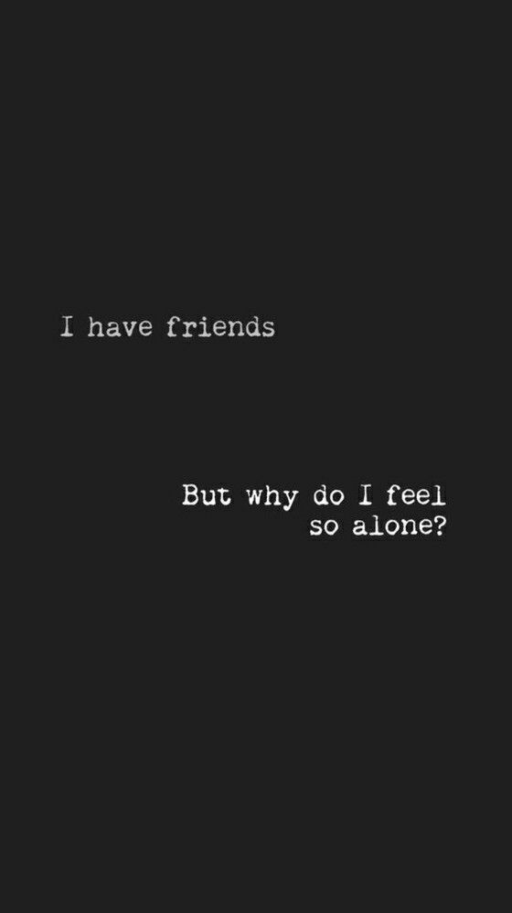

&nbsp;
# Our world

&nbsp;

<iframe id="long-tuesday" style="filter: grayscale(100%);" width="100%" height="500px" src="https://www.youtube.com/embed/DBMye8NN6Xw" frameborder="0" allow="accelerometer; autoplay; clipboard-write; encrypted-media; gyroscope; picture-in-picture" allowfullscreen></iframe>

### My world looks different in my eyes and in my mind but we walk the same earth. Different realities.

I want to share my heart with you all, take it all, smile and know that you are more than capable.

It’s time to top up the heart of gold, empty for now, I need to take the time to work on myself, reflect and fill it with more love to give.

The thing that really makes the world turn round, our ability to fill the world with love each day. A smile from across the room, eyes engaged in a conversation without a word. I remember that I’m not alone, you see me.

Your own version of me, but I’m here and I remember to escape the storm in my mind.

Let the thunder subside, the sound of rain and wind fades. Silence for a moment. A flutter in time, thank you, I don’t know your name but I thank you with a smile of gratitude.

Where am I? So lost in thought, I forget to be present, how did I get here? Hiding in my mind, over-thinking everything my consciousness is aware of. I can do better. I know what I’m capable of and I should be better.

The pressure of self criticism. Why did I disappoint them today? Tomorrow you will do better. 

A never ending battle in my mind.

Come join me on my little journey. Bringing myself back to reality, it’s 20:32pm - 13/03/2021. Whatever that means, I feel the rain on my cheek, the ocean is cold but not too cold. My feet tense as the waves lap over the top of them, and they relax as I feel the sand soft beneath them. I look crazy, don’t fear I am not here to do anything sinister. Just embracing reality when I need it most. A quick swim in the ocean to bring me back and physically refresh my mind, I feel the salt as the water drys, and I sit to write this down.

Get it out of your mind and in writing. So you can rest easy old man. I realise I can have special moments in time, all by my own, no need to share it. Just enjoy it alone so that I can find joy by myself. I’m trying not to depend on others for my own happiness, it’s a long journey but it’s a fulfilling one at that.

Time goes faster when I’m here experiencing it all, it draws on forever in the cavity of my mind. Monday this week my world came to a stand still, the pain I created with my own selfish desires that were denied cut my heart. It took me a while to reflect and understand what I was going through. Self inflicted pain, the worst thing I could do is spread my own pain into the world.

It’s ok to feel the pain, let it go. A reminder that I’m human, and I am capable of feeling. My heart burst, a painful reminder of what I crave. Love.

I felt my heart burst in a moment of love, let it all out, and I sat and felt empty as I realised I had poured it all out, and didn’t have anything to top it back up with.

Emptiness, loneliness and despair. I am not bitter, just fragile, hoping for the best and falling flat when my hope results in undesirable outcomes. 

Does hope create expectation? And this time results in disappointment, my own doing. I take responsibility, I realised I had selfish hopes and desires. 

Doubt sets in, when will things go my way? Maybe I should change my ways? That can’t be right. Change myself to suit the situation and outcomes.

Go against what I truly believe. Be authentic, true to myself, honest, share my mind and just maybe the things I desire will come my way.

Love will find a way, just stay true to me.

Everyday I am challenged in one way or another, I’m trying my best to stand up and be who I am meant to be. It’s fucking difficult, and I’m reminded of that all too much. If it were easy, would I enjoy the rewards it brings as much? 

Take ownership of my actions, my successes and my failures. They are mine to bear and embrace. For I am me and no one else. 

My thoughts get heavy, and I have been trying recently to share them, so I don’t have to carry it all everyday. It makes it easier to process everything, I feel a sense of relief as I lift some of the weight off my shoulders.

A wholesome process, filling up the heart for the next few days to come. A reflection on my world, a glimpse into the eye of the storm.

The more time I spend realising that I need to find more fulfilment in myself, so that tomorrow I can be a better version of myself. It’s the best I can do for the world I share with you all. Gratitude and peace of mind. 

Who knows what tomorrow holds, but hopefully I will remember the days of past and make better decisions and react better tomorrow.

Hopefully I can find the attention I seek in the “right” way. Sharing my experiences and thoughts in a way that I will find someone who wants to listen. Until then, I will keep learning, and working on being a better me. Whatever better means.

Love makes the world go round.

Write to remember, write for clarity in your own mind. 

