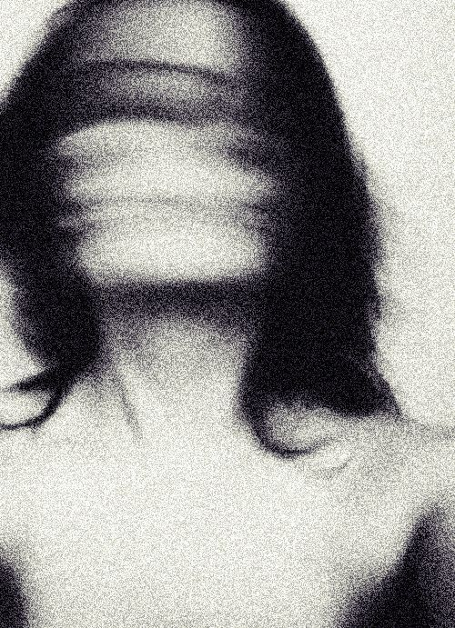

## Holding on

I greeted an old friend this week.

The green pill called Lily, has returned into my life, to hopefully bring stability to my reality.

I am struggling to sleep each night, I am restless. Anxious every day, worn down and tired. I had the strangest dream last night, Lily is a contributing factor, a side effect.

I am not sure if it was a dream or nightmare? I remember flashes of scenes in my mind as I slept, a sleeve sliding down a wrist. Revealing fissures on this wrist, scar tissue of a man attempting to leave our world. I don't know if this was my left wrist, or someone else showing me to tell me something. I woke up this morning and it was the first thing I could think of, and it popped into my mind multiple times through out the day.

Why was this in my mind, I have not seen it before, my subconcious created it. What is it trying to tell me?

I feel nothing, I am intrigued almost curious in a way. What is this vision symbolic of? Death? A warning? Suicide? A desire to die? Escape? Running from the pain.

<!--  -->

<!-- 

<iframe id="her-video" style="filter: grayscale(100%);" width="100%" height="500px" src="https://www.youtube.com/embed/W74E0wWUcqY" frameborder="0" allow="accelerometer; autoplay; clipboard-write; encrypted-media; gyroscope; picture-in-picture" allowfullscreen></iframe>

 -->