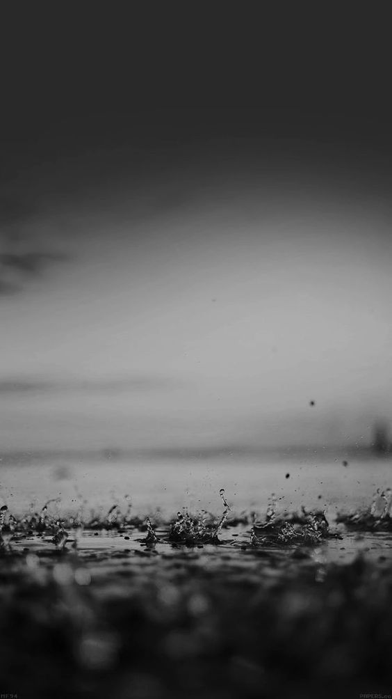
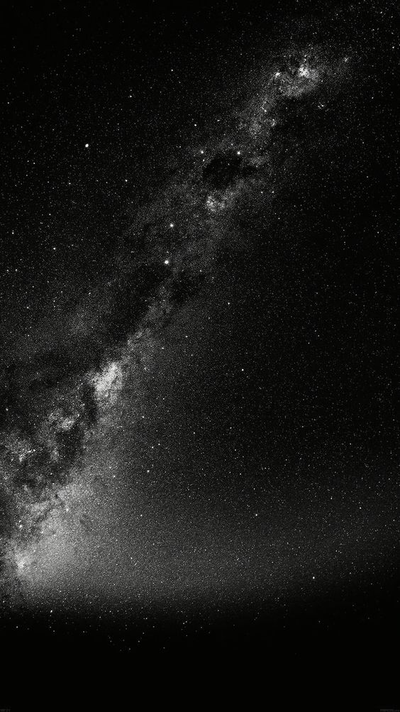
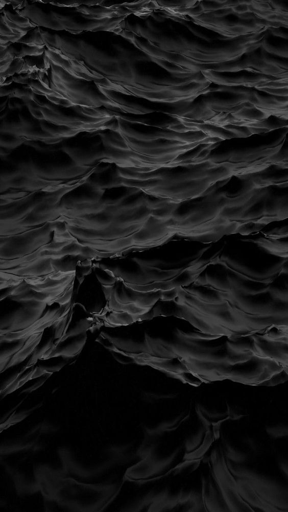

&nbsp;

# Why go through it all

I ask myself this question every day.

## Doubt

I fill myself with doubt. Life is constantly on the edge for me, walking on a knife's edge. No matter how far I walk, the blade is just as sharp as the last step, never fading or dulling. 
Trying to balance while life hurls its shit my way.

Am I the little delicate butterfly floating in a hurricane? The one in my nightmares. Dodging the raindrops, no control over where I am going. I try to fly but the wind dictates my direction, no matter how hard I try. I feel insignificant, with no control. Powerless.

## Where am I?

Lost in the chaos, it is dark, the thunder rumbles my head. Flashes of lightning. The white fades and I see the deep black sky of the night. Stars flickering in the distance. Eyes watching me from above, I feel vulnerable. Exposed, raw for all to see.

Are you up there? Can you see me, do you care? What does any of this even mean? Why am I here? Am I meant to survive this? Is my fate not certain, aware of my inevitable doom? Existence shall cease, share my ending for we are all headed in one direction.

Why do I care? Does anyone else care? The butterfly so fragile and delicate, dancing in the wind. 
The winds of life, my eyes open, I am floating on the ocean, paralyzed I can't lift my head. I cannot lift my wings they are drenched, yet I can move my eyes.

Is this significant? Surrounded by confusion, of nothing I am certain, except my ending. Are the clouds doubt? That is why I cannot see, the clouds mask all that I see, yet every few minutes there is a gap in the clouds. Is this temporary focus? What is my purpose, are we not all in search of the same answer?

I dream of the stars, the black night, the void of space, the void in my mind and heart.

I do not care for figuring out my purpose, I will fulfil my purpose by being me.

My mind bursts as a lightning bolt through my consciousness, a flash of white setting my eyes a light, even as they are closed.

## Cut me, remind me that I bleed.

The pain is home, senses numbed again, comfort in a familiar home.

A bruised, scarred and broken heart, hoping one day you will make me forget the pain.

Love will transcend it all. And I will never stop loving with all my heart. As naive as I may be. Innocence, protect my fragile being, for what I do not know cannot hurt me.